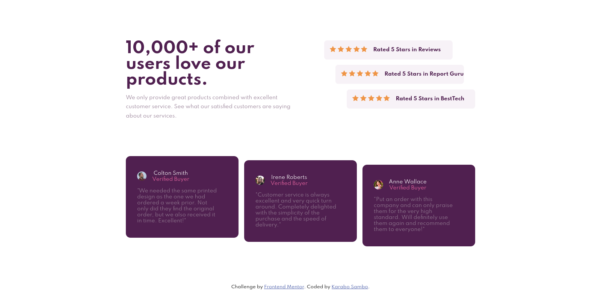

# Frontend Mentor - Social proof section solution

This is a solution to the [Social proof section challenge on Frontend Mentor](https://www.frontendmentor.io/challenges/social-proof-section-6e0qTv_bA). Frontend Mentor challenges help you improve your coding skills by building realistic projects. 

## Table of contents

- [Overview](#overview)
  - [The challenge](#the-challenge)
  - [Screenshot](#screenshot)
  - [Links](#links)
- [My process](#my-process)
  - [Built with](#built-with)
  - [What I learned](#what-i-learned)
  - [Continued development](#continued-development)
- [Author](#author)

## Overview

### The challenge

Users should be able to:

- View the optimal layout for the section depending on their device's screen size

### Screenshot

### Links

- Solution URL: [https://github.com/blaqbox-prime/social-proof-section](https://github.com/blaqbox-prime/social-proof-section)
- Live Site URL: [https://blaqbox-prime.github.io/social-proof-section/](https://blaqbox-prime.github.io/social-proof-section/)

## My process
I start off with creating color variables in the document root. Then creating the css classes for text colors and background colors. I then analyze the design and chopped it into 2 big sections (top and bottom) then split those sections furthur into smaller content containers and start writing the css for those containers as closely as possible to the design. After going as far as I can with the styling I then write the HTML with the classes I've already created. From there everything is adjusted as the HTML is written.

I use a mobile first aproach so the mobile ui is the initial style then a media query for larger screens, 760px+ is used to create the desktop design. For the desktop layout I tried using CSS Grid and while I'm not completely confident nor satisfied with the results it came out pretty well 

### Built with

- Semantic HTML5 markup
- CSS custom properties
- Flexbox
- CSS Grid
- Mobile-first workflow
- [GSAP](https://greensock.com/) - JS Animation library

### What I learned

I got to work on CSS Grid and Grid Areas which is still a learning curve to be conquered for me but, I think I am showing some improvement.

## Author

- Instagram - [@ig_blaqbox.dev](https://www.instagram.com/ig_blaqbox.dev)
- Frontend Mentor - [@blaqbox-prime](https://www.frontendmentor.io/profile/blaqbox-prime)
- github - [@blaqbox-prime](https://www.github.com/blaqbox-prime)

